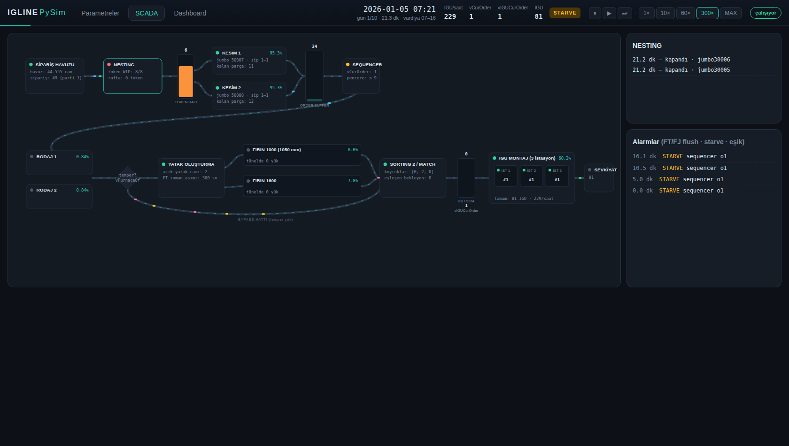
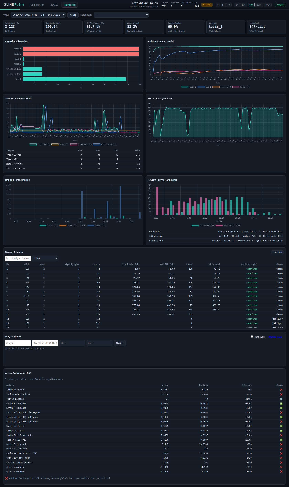

# IGLINE-PySim

**Rockwell Arena 14 — Senaryo 3 IGU (ısıcam) üretim hattı modelinin Python
ayrık-olay simülasyonu portu.** Çift kesim + çift rodaj + çift temper fırını
(1000/1600 mm) + bypass + 3 istasyonlu IGU montaj hattını; jumbo nesting,
kesim tokenleri, sipariş-sıralı serbest bırakma (Sorting #1), temper yatak
oluşturma, fırın sapma kuralı, pane eşleştirme (Sorting #2) ve katı sipariş
kapısı dahil **kural kural** (R1–R14) modeller.



## Kurulum

```bash
pip install -e .            # simpy, numpy, pandas, pyyaml, fastapi, uvicorn
pip install pytest          # testler için
```

## Kullanım

### Headless (UI'sız)

```bash
python -m igline run --days 10 --seed 42                 # tek replikasyon
python -m igline run --days 10 --seed 42 --replications 5 # ortalama ± yarı-genişlik
python -m igline validate                                 # Arena A.4 doğrulaması + validation_report.md
```

Çıktılar `runs/<run_id>/` altına yazılır: `params.yaml` (dondurulmuş parametre
seti), `igu_results.csv`, `jumbo_detail.csv`, `jumbo_results.csv`,
`temp_results.csv`, `orders.csv`, `series.json`, `distributions.json`,
`event_log.jsonl`, `summary.json`. Koşular `runs/runs.db` (SQLite) içinde
endekslenir.

### Web arayüzü (SCADA + Dashboard)

```bash
python -m igline serve          # http://127.0.0.1:8000
# veya: make serve
```

Üç sekme:

1. **Parametreler** — A.3 tablosundaki tüm parametreler (Arena değişken
   adları tooltip'te), dizi editörleri (vFurnaceOf, vHeatT), ürün karması CSV
   yükleme + önizleme, profil kaydet/yükle, canlı/headless koşu başlatma.
2. **SCADA** — hat topolojisini birebir yansıtan koyu temalı mimik diyagram:
   istasyon kartları (durum LED'i, anlık iş bilgisi, kullanım), tampon
   barları, fırın tünellerinde ilerleyen yatak yükleri, bypass hattı,
   akış animasyonu, istasyon detay paneli, alarm şeridi (FT/FJ flush,
   starve). Hız: 1×/10×/60×/300×/MAX + duraklat/adım.
3. **Dashboard** — KPI kartları, kullanım/tampon/throughput zaman serileri,
   doluluk ve çevrim histogramları, sipariş tablosu (CSV dışa aktarım),
   olay günlüğü görüntüleyici, koşu karşılaştırma, Arena A.4 doğrulama
   tablosu.



## Makefile hedefleri

```bash
make test        # birim + entegrasyon testleri
make run         # 10 günlük headless koşu (seed 42)
make validate    # 5 replikasyonlu Arena doğrulaması
make serve       # web arayüzü
```

## Arena ↔ Python eşleme tablosu

| Arena kavramı | Python karşılığı |
|---|---|
| REPLICATE (5 Oca 2026 07:00, 10 gün × 9 saat) | `run.start_datetime`, `run.days`, `run.hours_per_day`; sim saati kesintisiz 5400 dk akar, takvim gösterimi 9 saatlik iş günlerine maplenir (R1) |
| CREATE (162.000 sn) + vGenAcc döngüsü | `Line.order_generator` (R2) |
| DISC 66 satırlık ürün kodu | `data/product_mix.csv` + `decode_product` (R2) |
| LOGN(340,650), GAMM(30.3,1.81), TRIA | `engine/rng.py` — Arena eşleniği dönüşümlerle |
| Hold Glass (seq sıralı) | `Line.pool` (PoolGroup listesi; ünite-bazlı SEPARATE interleave) |
| Nesting Packer + shelf yerleştirme | `controllers.nesting_packer` + `engine/nesting.py` (R3) |
| Jumbo kapanış + kesim tokeni (tokMin LVF) | `Line.close_jumbo`, `token_buffer` (R4) |
| Jumbo Flush denetleyicisi (5 dk + FJ) | `controllers.jumbo_flush_controller` (R4) |
| Dispatcher lookahead Hold'u | `controllers.dispatcher` (R5; olay tabanlı + periyodik tarama) |
| Kesim_1/2 (trim + kırım) | `Line.cutting_machine` (R6) |
| Order Buffer + Sequencer (Sorting #1, 2× eşik) | `Line.buf` + `controllers.sequencer` (R7; `strict_pane_feed` parametrik) |
| Rodaj H/W örtüşmeli seize | `Line.glass_flow` (R8) |
| Temper yatak (vWAccum genişlik doldurma) | `Line.temper_arrival` / `close_bed` (R9) |
| FT timer + FT denetleyicisi (vTmax) | `Line.ft_timer` + `controllers.temper_flush_controller` (R10) |
| Fırın seçimi (vDivN sapma) + pitch + tünel | `Line.bed_flow` (R11; tünel kaynak tutmaz) |
| MATCH (unitKey=orderNo) + Hold IGU Order | `Line.to_match` + `Line.igu_gate` (R12) |
| IGU_1 (kapasite 3) + vIGUCurOrder ilerletme | `Line.igu_unit_flow` (R13) |
| TALLIES / DSTATS / kaynaklar | `engine/stats.py` (Tally, DStat, BusyMeter) |
| Çıktı dosyaları | `io/writers.py` (R14) |

## Parametre sözlüğü

Tüm parametreler `config/default_params.yaml` içinde gruplanmıştır (koşu,
sipariş, nesting, kesim, sequencer, rodaj, temper, IGU); her alanın Arena
değişken adı ve birimi hem YAML yorumlarında hem UI tooltip'lerinde yer alır.
Koşu başlangıcında etkin set `runs/<run_id>/params.yaml` olarak dondurulur.

Önemli sadakat notları (bkz. Bölüm D yönergesi):

- **Sequencer 2× eşiği** Arena'daki gibidir; `sequencer.strict_pane_feed=true`
  ile `paneCount × adet` eşiğine geçilebilir.
- Fırın tüneli kaynak tutmaz (saf gecikme); giriş kaynağı darboğaz kapısıdır.
- `vL_heat = vFurnLen = 22000` her iki fırın için kabul edilmiştir (parametrik).
- Kırık cam/yeniden işleme bu senaryoda yoktur; `Line.rework_hook` genişleme
  noktası olarak boş bırakılmıştır.

## Ürün karması hakkında önemli not

Orijinal Arena exp dosyasının (203$ bloğu) 66 satırlık DISC tablosu bu depoda
mevcut olmadığından `data/product_mix.csv`, kod şemasına ve A.4 referans
metriklerine kalibre edilmiş **sentetik bir tablodur**
(`tools/gen_product_mix.py`; belgelenmiş ilk satır birebir korunur). Gerçek
tablo elde edildiğinde aynı iki kolonla (`cum_prob,code`) dosyayı değiştirmek
veya UI'dan yüklemek yeterlidir — başka hiçbir şey değişmez. Doğrulama
sonuçları ve veri kaynaklı sapmaların kök neden analizi için
`validation_report.md` dosyasına bakın.

## Doğrulama (Arena A.4)

```bash
python -m igline validate --replications 5 --seed 42
```

5 × 10 günlük replikasyon ortalaması A.4 tolerans bantlarıyla karşılaştırılır
ve `validation_report.md` üretilir. Mevcut durumla 11 metrik bantta
(tamamlanan IGU, kesim/IGU/fırın/rodaj kullanımları, jumbo/temper doluluk,
kesilen jumbo, toplam adet); kalan sapmaların tamamı raporda kök nedenleriyle
belgelenmiştir (vDDwin termin-penceresi önceliklendirme hacmi, sentetik ürün
karması, Arena'nın SPLIT yeniden-sayımı kaynaklı tanımsal cam sayacı farkı).

## Performans

10 günlük headless koşu (~33.000 IGU, ~67.000 cam, ~1M olay): **~6–9 sn**
(hedef ≤ 60 sn). Canlı 60× modda motor yükü bir çekirdeğin çok altındadır.

## Testler

```bash
make test                          # hızlı takım (rng, nesting, motor, çıktılar)
pytest tests/test_validation.py    # Arena doğrulaması (~30 sn)
```
